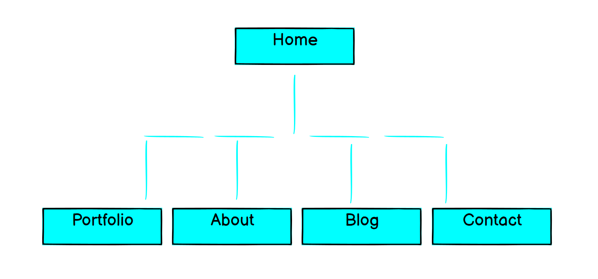

# Chris Hannam's Portfolio Website, a readme

### Links

A link to [my portfolio website](https://wizardly-roentgen-4dab52.netlify.app/)

A link to [my github repo](https://github.com/noodulcode/ChristopherHannam_T1A2)

### Goals

- To have a semantically and syntactically written and highly accessible website to showcase the current and ongoing portfolio of a web developer.  

- To build an online portfolio that provides information about the skills, interests, professional knowledge and a showcase of the developer’s work.  
- To successfully target an audience for the portfolio website, that of an employer looking to engage the developer and/or an IT professional.  

- And in so doing, to comprehensively provide the code and documentation for and through a slideshow, the presentation of, the thought process and design of said website.
- The website features a common navbar and footer, home portfolio and about me pages styled with CSS grid, an extensive blog page and contact page styled with flexbox, a resume PDF, components with images, blurbs and text, links to different platforms for ease of getting in contact and is built with a responsive design.  
- Techstack     

### Sitemap of the website

- A simple site needs a simple sitemap. I have 5 pages starting with the home page all other pages are easily navigable from here. I ordered the pages from probably the most important to the least.
All pages are accessible from one another and all link to the Home page as well. I’ve used simple names for all the pages for ease of understanding and navigation.

### Screenshots of the website as vewed on an iphone:

#### Home Page

#### Portfolio Page

#### About Page

#### Blog Page

#### Contact Page

